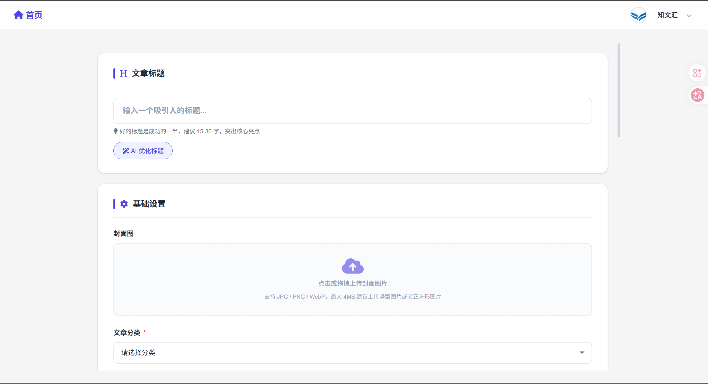

# 知文汇 (ExtraordinaryBlog)

> 一个带 AI 的博客系统，写文章、看热榜、跟大模型聊天。业余时间慢慢攒出来的。

[](https://www.djangoproject.com/)
[](https://www.python.org/)
[](https://www.langchain.com/)

## 这是个啥

本职写后端，一直想搞个自己的博客。市面上静态博客太多了，干脆自己手搓一个带数据库的，顺便把这两年折腾的大模型也塞进去。

核心就三件事：**写博客**、**看热榜**、**问 AI**。所有文章存向量库，AI 回答问题时从我写过的文章里找上下文，回答得还算靠谱。

### 长什么样


首页就是文章列表加侧边栏，中规中矩。热榜数据是定时任务自动爬的，不用手动搬。

### AI 问答


这个是我最花时间的部分。基于 LangChain + ChromaDB 做的 RAG，所有文章先向量化存起来，用户提问时检索最相关的几篇当上下文再丢给大模型。用的火山引擎豆包 API，比直接调 OpenAI 便宜不少。

### 写文章



Markdown 编辑器，支持拖图进去。写完可以点一下让 AI 帮你优化标题或者生成摘要，懒人福音。

## 技术栈

| 层 | 用了啥 |
|---|--------|
| 框架 | Django 4.2 + DRF |
| 数据库 | MySQL（线上）/ SQLite（本地开发） |
| 缓存 | Redis（页面缓存 + 接口限流） |
| 大模型 | 火山引擎豆包 API + LangChain |
| 向量库 | ChromaDB（文章向量化存储） |
| 定时任务 | APScheduler |
| 前端 | Django Templates + 一点点原生 JS |
| 部署 | Nginx + Gunicorn + WhiteNoise |

## 项目结构

```
ExtraordinaryBlog/
├── article/                 # 文章模块（核心）
│   ├── models.py           # 文章、分类、标签、评论
│   ├── views.py            # 视图 & API
│   ├── ai_utils.py         # AI 摘要、标题优化
│   ├── crawl_juejin.py     # 掘金热榜爬虫
│   ├── crawl_csdn.py       # CSDN 热榜爬虫
│   └── tts_utils.py        # 文字转语音
├── authentication/          # 用户认证
│   ├── views.py            # 注册、登录、密码重置
│   └── utils.py            # 邮件、激活码
├── core/                    # 首页、搜索、AI问答
│   └── views.py
├── users/                   # 用户中心
│   ├── models.py           # 用户扩展（积分、个人资料）
│   └── views.py
├── middleware/              # 自定义中间件
│   ├── ip_rate_limit.py    # IP 限流
│   ├── gzip.py             # Gzip 压缩
│   ├── security_headers.py # 安全头
│   └── maintenance_mode.py # 维护模式
├── utils/
│   ├── rag_chain.py        # RAG 问答链（核心）
│   └── content_audit.py    # 内容审核
├── templates/               # Django 模板
├── static/                  # 静态资源
└── extraordinaryblog/       # 项目配置
    └── settings.py
```

总共写了差不多一万两千行 Python，断断续续搞了几个月。

## 功能清单

- **文章 CRUD**：Markdown 写作，分类 + 标签，封面图上传
- **AI 摘要 & 标题优化**：调大模型自动生成，也可以手动写
- **RAG 智能问答**：基于全站文章内容的问答，不是那种瞎编的
- **热榜聚合**：定时爬掘金热榜（CSDN 的也写了但没怎么用），去重后入库
- **评论系统**：支持嵌套回复、点赞，加了敏感词过滤
- **用户系统**：注册（邮箱激活）、登录、个人中心、积分
- **学习中心**：题库 + 错题本，算是个附加功能
- **数据可视化**：简单的图表统计
- **中间件**：IP 限流、Gzip、安全头、维护模式开关

## 本地跑起来

### 1. 装依赖

```bash
python -m venv .venv
source .venv/bin/activate
pip install -r requirements.txt
```

### 2. 配环境变量

项目根目录建个 `.env`：

```env
SECRET_KEY=你随便生成一个django密钥
DOUBAO_API_KEY=火山引擎的API Key
DOUBAO_BASE_URL=https://ark.cn-beijing.volces.com/api/v3

# 如果用 MySQL
MYSQL_DATABASE_NAME=blog
MYSQL_PASSWORD=你的密码

# 邮件（注册激活用）
EMAIL_HOST_USER=你的邮箱
EMAIL_HOST_PASSWORD=邮箱授权码
```

### 3. 初始化

```bash
python manage.py migrate
python manage.py createsuperuser
```

### 4. 启动

```bash
python manage.py runserver
```

打开 http://127.0.0.1:8000 就能看到了。

## 线上部署

我现在跑在一台云服务器上，Nginx + Gunicorn，Static 用 WhiteNoise 处理。

```bash
gunicorn extraordinaryblog.wsgi:application -w 4 -b 0.0.0.0:8000
```

## TODO

- [ ] 爬虫改用 Celery 异步，现在 APScheduler 偶尔会卡
- [ ] 向量检索目前用的 ChromaDB，后面想试试 Milvus
- [ ] 文章搜索加 Elasticsearch
- [ ] 移动端适配还差点意思

## License

MIT — 随便用，觉得有用给个 star 就行。
